## 绪论

### 研究背景及意义

随着网络技术的发展, 网络购物已经成为人们的第二大购物体验。而对于用户来讲, 自动售货机既具备传统实体店的即视选择优点, 又由于其分布零散、范围广阔、支付方便等特点可与网店购物媲美, 而在全世界范围内得到了广泛应用。自动售货机是商业自动化的常用设备，它不受时间、地点的限制，能节省人力、方便交易。

随着信息科技时代的到来，人们的生活与消费方式发生重大改变。自动售货机的发展要把人们因工作生活方式改变产生的需求，通过科学技术提升进行解决。不仅仅只提升自动售货机在市场的占有率，重要的是从自动售货机用户体验出发，提高自动售货机的质量及功能，抢占新零售时代新的消费方式的机遇。使自动售货机成为人们工作、生活服务功能单元的一部分，清晰自动售货机在新零售时代的定位，成为一个时代及相应群体的生活标志，这样自动售货机时代才是真正来临。

### 设计任务及要求

#### 设计任务

自动售货机系统基本功能和扩展功能如下表所示

|        基本功能         |        扩展功能         |
| :---------------------: | :---------------------: |
|       LCD显示商品       | LCD屏显示商品名称及余量 |
| K1、K2键模拟选择4种商品 |    中断检测键盘按键     |
|   K3键为确认选择商品    |      商品价格显示       |
|    电机转动模拟出货     |   用户扫描二维码付款    |
|    电机硬延时转动1秒    |   商品无货，提示用户    |
|                         |   管理员输入密码上货    |
|                         |     管理员查看收益      |
|                         |  商品保温，数码管显示   |

利用8255、8253、0832、LED屏显示模拟自动售货机，设定K1、K2键模拟4种商品K3键为确认购买。当选择好购买种商品由LCD屏显示后，0832控制电机转动1秒（1秒时间由8253提供）。

#### 设计要求

- 使用汇编语言，利用宏（macro）和子程序（proc）优化代码
- 设计系统电路图
- 绘制系统各功能流程图
- 学习LCD屏的使用方法，显示字符与绘制图像
- 学习8259芯片，使用中断控制
- 使用两个数码管，分别表示温度的十位与个位
- 使用8253芯片，使电机转动1秒
- 密码匹配检测输入密码是否正确

## 系统设计需求分析

### 开发环境及开发平台

> 开发环境：HQFC-A实验箱及HQFC-A微机接口软件
>
> 开发语言：汇编
>
> 开发平台：Windows 7操作系统

### 设计的主要算法及分析

- LCD屏字符显示
  - 首先确定输出位置，LCD可以显示四行中文，起始地址分别为：80H、90H、88H和98H，每行可以显示八个汉字，显示地址为前一个汉字地址加一。先设定DDRAM地址，输出显示起始地址，然后将D/I端置0，为数据端，R/W置为0，为写入端，使能信号置1，再置为0。因为汉字占用16位两个字节，需要依次输出汉字编码高字节和低字节，需要将D/I端置1，才能输出汉字。
- 货物余量计算
  - 在数据段设置物品余量的变量，当用户购选择相应货物时，首先判断余量个位是否为0，若不为0，则显示货物价格和付款二维码，待用户付款后，个位数字减1，否则再判断十位是否为0，若为0，则输出“库存不足”，否则显示货物价格和付款二维码，待用户付款后，十位数字减1，个位数字变为9。
- 密码匹配
  - 当管理员按下补货按钮时，提示输入口令，管理员输入的密码实时显示在LCD上，每输入一位，后台就将临时地址相应位置的值改为输入值，等输入4位密码后，自动检查密码是否与预设密码匹配，若匹配，则打开货仓，进行补货，否则输出“密码错误”。
- 按键确定
  - 首先向键盘每一行都输入0，然后检查键盘列值是否有0输出，且持续20ms以上，若无，则继续检测是否有按键按下，否则，依次向每行输出0，然后检测每一行的另一端是否均为1，若不是则转去编码。
- 收益计算
  - 每当用户成功购买商品，则收益加上相应的值。查看时，首先将收益值赋值给AX，除以64H（十进制100），商在AL，余数在AH，继续对余数除0AH（十进制10），得到商和余数，就可以获得整个收益的百位、个位和十位值。
- LCD显示图像
  - 首先关闭LCD的绘图显示功能（34H），然后将水平的位元祖坐标（X）写入RAM地址，再将垂直的坐标（Y）写入绘图RAM地址，之后连续向RAM写入两个8位的图片编码，循环直到图片编码全部写完，最后打开绘图功能显示功能，图片就可以显示完全。

### 系统的组成及工作原理

- 8255芯片
  - 8255是可编程并行I/O接口芯片，有3个8位并行I/O口。具有3个通道3种工作方式的可编程并行接口芯片（40引脚）。通过向8255的控制字寄存器写入方式选择字，就可以规定3个口的工作方式。
- 8259A芯片
  - 8258A芯片是可编程中断控制器，通过对它进行编程，写入初始化命令字ICW和控制命令字OCW。中断的来源除了来自于硬件自身的NMI中断和来自于软件的INT n指令造成的软件中断之外，还有来自于外部硬件设备的中断，这些中断是可屏蔽的。这些中断也都通过可编程中断控制器PIC进行控制，并传递给CPU。
- DAC0832芯片
  - DAC0832是8位的D/A转换集成芯片。D/A转换器由8位输入锁存器、8位DAC寄存器、8位D/A转换电路及转换控制电路构成。可以把从CPU送来的数据先打入输入寄存器，在需要进行D/A转换时，再选通DAC寄存器，实现D/A转换，本次实验所用芯片为单缓冲。
- ADC0809
  - ADC0809是8位的A/D转换集成芯片。使用CBA引脚确认转换通道，在START和ALE脚上加一个正脉冲，将通道选择码锁存并启动A/D转。转换开始后，EOC变低，经过64个时钟周期后，转换结束，EOC变高。转换结束后，通过IN指令，设法在OE脚上形成一个高电平脉冲，打开输出缓冲的三态门，让转换后的数字量出现在数据总线上，并被读入累加器中。
- LCD屏
  - 液晶显示模块是128×64点阵的汉字图形型液晶显示模块，可显示汉字及图形，内置8192个中文汉字（16X16点阵）、128个字符（8X16点阵）及64X256点阵显示RAM（GDRAM）。可与CPU直接接口，提供两种界面来连接微处理机：8-位并行及串行两种连接方式。具有多种功能：光标显示、画面移位、睡眠模式等。使用不同的指令可以使用相应的功能，比如：清除、写字符、绘图等。
- 数码管
  - 由多个发光二极管封装在一起组成“8”字型的器件，引线已在内部连接完成。每个数码管加上小数点，由八个LED灯组成，用a、b、c、d、e、f、g和dp来表示各个LED灯，向八个引脚输出不同的电平可以显示不同的字符。

## 系统的总体设计

### 系统功能层次图

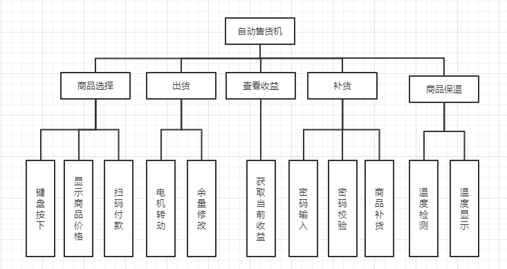

### 系统功能设计

- **商品购买**
  - 利用键盘选择商品编号和确认选择商品，LCD屏展示商品列表、付款二维码和商品购买结果。

- **商品出货：**
  - 利用8253硬件延时1秒，控制电机转动的时间，LCD屏显示出货结果。

- **收益查询：**
  - 利用数据段一个数据保存自动售货机的收益金额，键盘控制选择查询收益，LCD屏用于展示收益金额。

- **补货模块：**
  - 利用键盘控制补货选择和密码的输入，数据段保存输入密码和预密码，LCD屏显示密码的正确与否，进而可以控制货仓能否打开。

- **商品保温模块：**
  - 利用温度扩展版获取当前温度的模拟量，用ADC0809芯片将模拟量转为数字量，进行标准化，进而在两个七位数码管显示当前的温度。

### 系统电路图

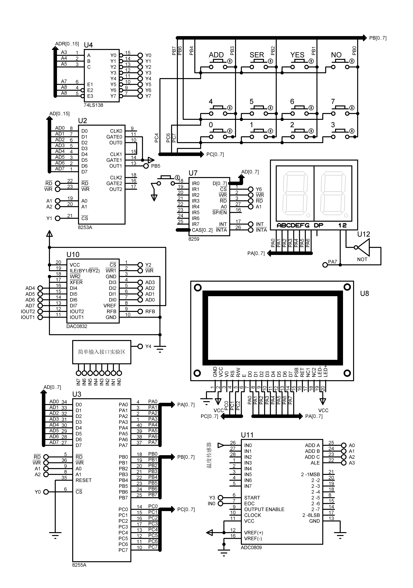

## 系统的详细设计

###  商品购买模块设计

####  程序流程图或算法流程图

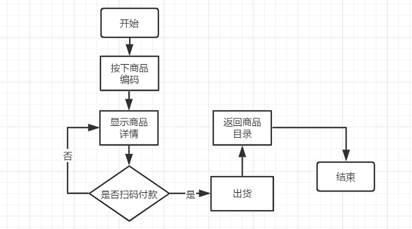

#### 系统功能实现

首先LCD屏会展示当前自动售货机的商品和其余量，当用户选择一个有余量的商品，按下相应编号的按键，LCD显示屏会展示商品的价格和二维码，用户扫码后，按下确认键，电机就会转动，进行出货。

#### 运行界面截图

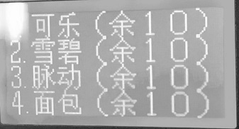

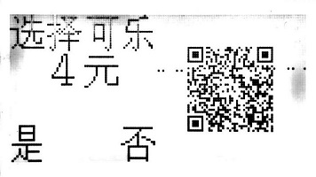

###  出货模块设计

#### 程序流程图或算法流程图

#### 系统功能实现

用户成功购买商品后，会执行两段不同操。一是，8253初始化，延时1s，然后向0832输出高电平，电机转动，模拟商品出货，LCD屏显示正在出货，当1s结束后，电机停止转动，LCD屏显示出货成功。二是，当物品出货完成后，需要修改库存和增加收益。首先判断相应商品的余量个位是否为0，若为0，继续判断十位是否为1，若为1，则十位置为0，个位置为9，若个位不为0，则置个位为原来值减1。然后，库存余量存储增加相应的收益。

#### 运行界面截图

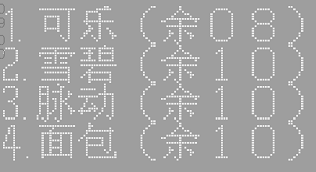

### 收益查询模块模块设计

#### 程序流程图或算法流程图

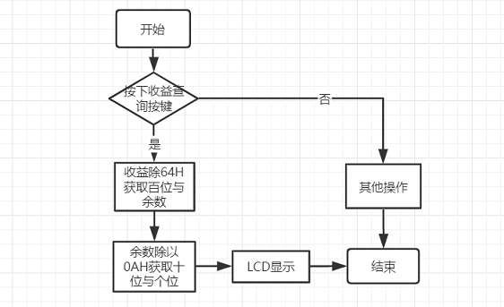

#### 系统功能实现

当管理员按下收益查询按钮后，系统会获取当前的收益，由于是16进制储，并且需要展示在LCD屏上，所以需要进行计算。首先将收益值赋值给AX，除以64H（十进制100），商在AL，余数在AH，继续对余数除0AH（十进制10），得到商和余数，就可以获得整个收益的百位、个位和十位，在LCD屏上显示即可。

#### 运行界面截图

### 收益查询模块设计

#### 程序流程图或算法流程图

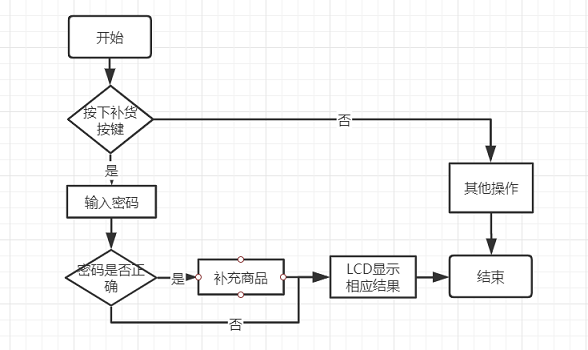

#### 系统功能实现

当管理员按下补货按钮时，LCD屏提示输入口令打开货箱，输入四位密码，若密码正确，则打开货箱，进行补货，否则提示密码错误。最后每件商品的余量都恢复至10个。

#### 运行界面截图

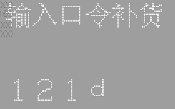

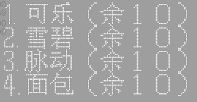

### 商品保温模块设计

#### 程序流程图或算法流程图

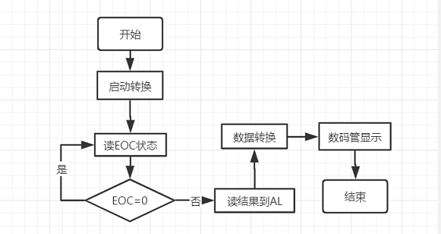

#### 系统功能实现

使用查询，来检测0809是否转换完成，若转换完成，则读取结果到AL，并进行相应的计算（除256乘最高温度），得到相应的温度值，再转换为数码管的编码，进行双位显示，延时1s后继续检测温度，一直循环保温。

#### 运行界面截图

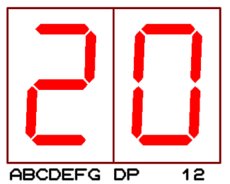

## 系统测试

### 遇到问题及解决办法

- **JE、JNZ跳转不能过长**
  - 这些指令属于条件转移指令，在8086系统中属于短转移，转移范围在-127到+127字节之间。可以通过一个中间标签进行跳转来解决，如：“JNZ TEMP1 TEMP1:JMP G1”。

- **LCD屏绘图，图片不显示**

  - LCD屏绘图需要先关闭绘图显示功能，然后写入X和Y值，再继续写入图像的编码值，最后再打开绘图功能。LCD屏是128*64的点阵，但是在绘图中，就为8*32的坐标点，原点坐标值为（80H,80H），了解到了这些，绘图显示才真正的会使用了。

- **LCD屏绘制一半图，另一半写字符异常**

  - 在实验箱上的LCD屏中，如果写入右侧的图像，但是不写入左侧的图像，左侧图像默认会与右侧图像一致，所以也需要向左侧LCD屏写入空白图像（00H），类似于清除GDRAM，在写入字符的时候，就不会出现图像和字符一起显示的异常了，在下次写入整屏字符时，需要先清屏才能正确显示字符。

- **键盘中断检测不可用：**

  - 虽然书上的8259芯片的使用方法已经掌握了，但是由于没有仔细看试验箱的构造，导致将从片误认为主片，一直出不来实验结果。之后了解构造后，在使用主片时又出现了问题，因为系统已经默认给主片进行了初始化，并且是系统中断，在键盘检测的过程中，屏蔽中断不可用，会导致一直发生中断，进而系统异常，达到不了预期效果。

- **INC [BX]错误**

  - INC是加1指令，INC后面放的是操作数，这个操作数可以是通用寄存器或是存储器。但是当为存储器时就不能直接写INC [BX]，[BX]是一个存储器的地址，必须用PTR 指令指明这个地址的类型,可以写INC BYTE PTR [BX],这样就表示[BX]这个地址指示的是一个字节,这样就可使[BX]中的内容加1。如果不指明类型，计算机不确定是[BX]所指字节加1，还是[BX]和[BX+1]所指的字进行加1。

- **代码冗余：**

  - 使用宏和子程序优化代码。宏可以加参数，类似C语言中宏定义所写的函数，但是注意标签不能重复，因为宏代码段是在编译的过程中是直接替换原来的宏调用的，会造成标签重复定义。子程序类似C语言中的函数用“CALL 子程序名”来调用，其中若定义标签可以在子程序开始写“LOCAL 标签名”来声明，这样就不会报重复定义的异常。

- **MOV AX,CS与MOV AX,DATA**

  - “MOV AX,CS MOV DS,AX”作用是让数据段和代码段是同一个段，能让编译出来的程序节省几个字节的大小。

  - “MOV AX,DATA MOV DS,AX”，DATA为数据段的段地址，执行这两段代码后，数据段的段地址被送入DS寄存器，这样对数据段中所有数据进行存取时，就不用再考虑这些数据所在位置的段地址。

- **使用DOS设置中断，造成数据段获取异常**

  - 在程序“ASSUME CS:CODE,DS:DATA”中，已经将数据段的段地址放入段地址，在设置中断向量的时候，DS寄存器的值又会被重新覆盖，造成无法正确取得数据段相应的值，所以需要先执行“PUSH DS”，将DS压入栈再设置中断向量，设置完成后，再执行“POP DS”，将数据段的段地址恢复，这样，在使用数据段的时候就不会发生异常了。

### 测试结果

|         测试项          |                            说明                            | 结果 |
| :---------------------: | :--------------------------------------------------------: | :--: |
| LCD屏显示商品名称及余量 |                    根据数据段数据显示。                    |  √   |
|    中断检测键盘按键     | 由于系统已初始化8259主片，改为由脉冲触发中断，再检测键盘。 |  √   |
|      商品价格显示       |                 根据所选商品的编号来显示。                 |  √   |
|      确认选择商品       |                      检测键盘确认键。                      |  √   |
|     用户二维码付款      |            掌握绘图要领，并且对图片编码达到效果            |  √   |
|     电机模拟出货1秒     |                   用两个8253通道累加延时                   |  √   |
|   管理员输入密码上货    |                 根据输入密码与预设密码匹配                 |  √   |
|     管理员查看收益      |              设计算法取得收益百位、十位与个位              |  √   |
|  商品保温，数码管显示   |         由扩展版获得的温度，设置上下限，硬延时获取         |  √   |

## 系统设计结果分析及结论

